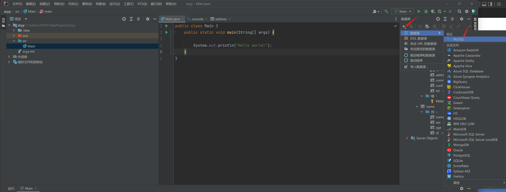

# IDEA的安装、配置、使用
# 1 IDEA的优势（相较于Eclipse)
-  强大的整合能力，`Git、Maven、Spring`等
-  提示功能快速、便捷
-  提示功能范围广（每个版本都可以提示`html\xml\js`等）
-  好用的快捷键和代码模板（`public static final psf`)
-  精准搜索
# 2 IDEA安装
- IDEA破解版链接    <https://www.exception.site/article/29>
- JDK直接在IDEA里面就可以安装
  新建->项目->下载不同版本的IDEA 就可以使用
  

# 3 连接数据库

  
如图所示，连接到数据库
# 4 工程目录
- src用于存放代码
- .idea和zcy.iml都是IDEA工程特有的，类似于Eclipse工程下的.settings,.classpath,project等。
- IDEA里面的代码是自动保存的。
# 5 新建项目
- 新建包
- 包下面新建类、接口、注解等（新建类，类下面可以选）。

# 6 Module模块
- Eclipse中有workspace（工作空间）和project（工程）的概念。IDEA中只有project(工程)和Module（模块）的概念。二者之间是一一对应的。
- Eclipse可以在同一窗口下管理N个项目，IDEA是打开多个窗口管理多个项目。
- IDEA一个项目下可以有多个Module，彼此相互依赖，共同开发。
- 删除Module:右击要删除的Module，选择`打开模块设置`,点击减号，删除，但是此时磁盘上还有；再次右击要删除的Module，点击删除就彻底的删除了。
# 7 项目结构和设置
- 所有的输出在out文件夹下

- 基本上有用的就是项目结构和设置

# 8设置
- 自动导包

- 代码提示不区分大小写

 