# IDEA的安装、配置、使用
# 1 IDEA的优势（相较于Eclipse)
-  强大的整合能力，`Git、Maven、Spring`等
-  提示功能快速、便捷
-  提示功能范围广（每个版本都可以提示`html\xml\js`等）
-  好用的快捷键和代码模板（`public static final psf`)
-  精准搜索
# 2 IDEA安装
- IDEA破解版链接    <https://www.exception.site/article/29>
- JDK直接在IDEA里面就可以安装
  新建->项目->下载不同版本的IDEA 就可以使用
<div align=center>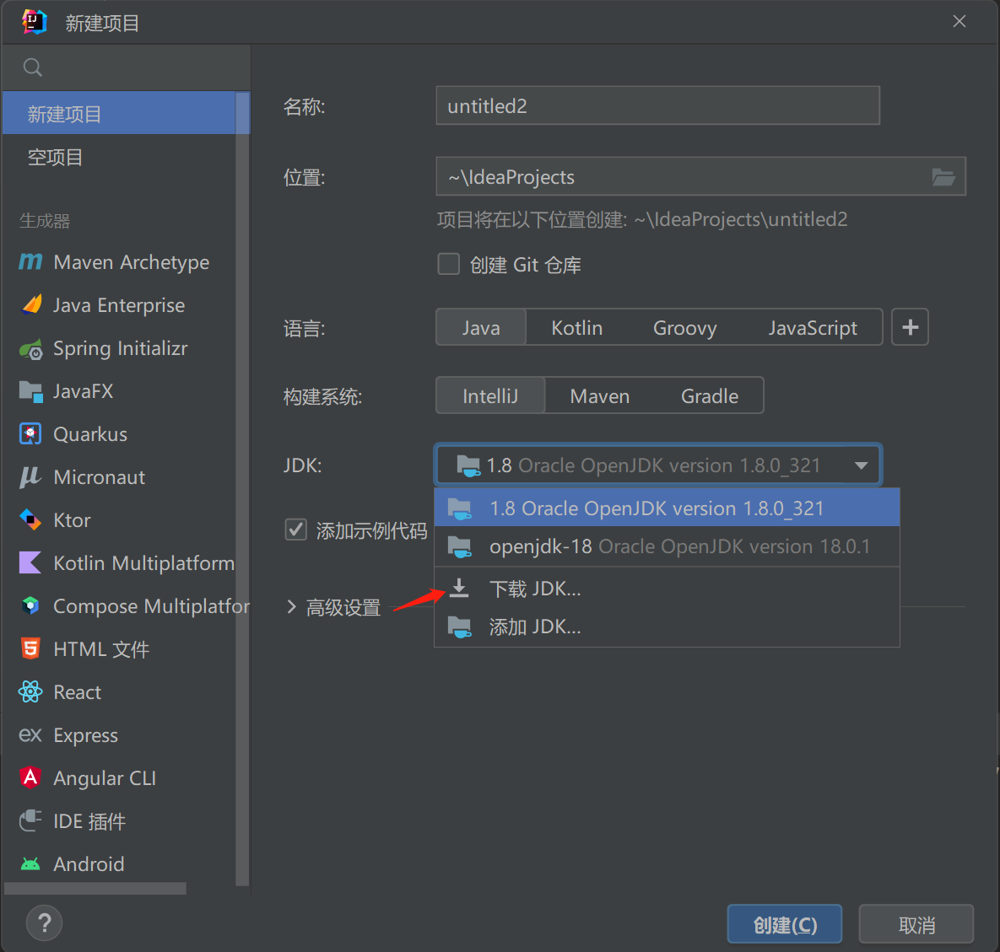</div>

# 3 连接数据库
<div align=center>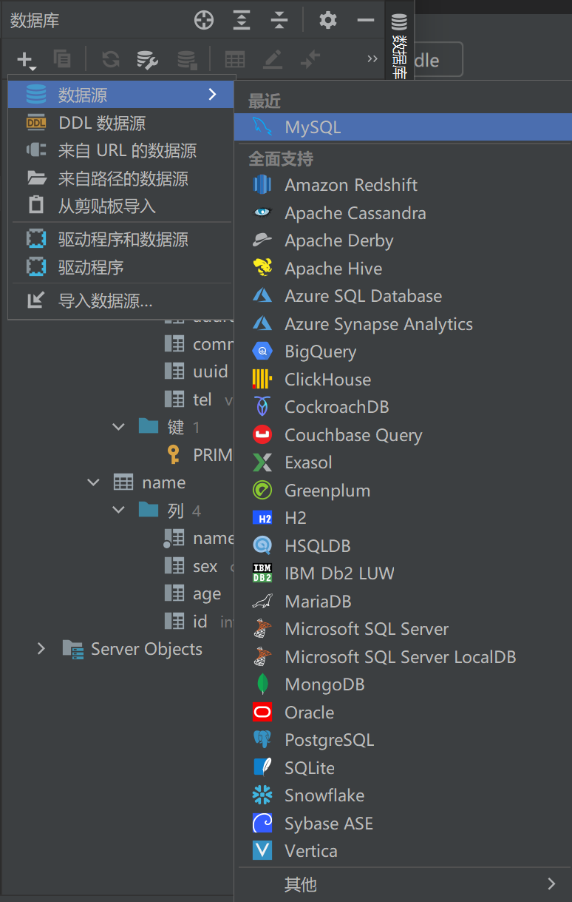</div>   
如图所示，连接到数据库 

# 4 工程目录
- src用于存放代码
- .idea和zcy.iml都是IDEA工程特有的，类似于Eclipse工程下的.settings,.classpath,project等。
- IDEA里面的代码是自动保存的。
# 5 新建项目
- 新建包
- 包下面新建类、接口、注解等（新建类，类下面可以选）。
<div align=center>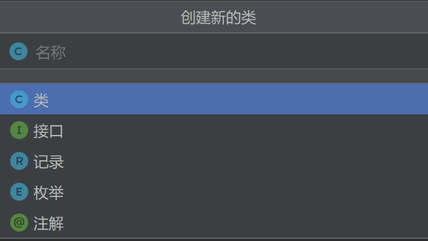</div>

# 6 Module模块
- Eclipse中有workspace（工作空间）和project（工程）的概念。IDEA中只有project(工程)和Module（模块）的概念。二者之间是一一对应的。
- Eclipse可以在同一窗口下管理N个项目，IDEA是打开多个窗口管理多个项目。
- IDEA一个项目下可以有多个Module，彼此相互依赖，共同开发。
- 删除Module:右击要删除的Module，选择`打开模块设置`,点击减号，删除，但是此时磁盘上还有；再次右击要删除的Module，点击删除就彻底的删除了。
# 7 项目结构和设置
- 所有的输出在out文件夹下<br>
<div align=center>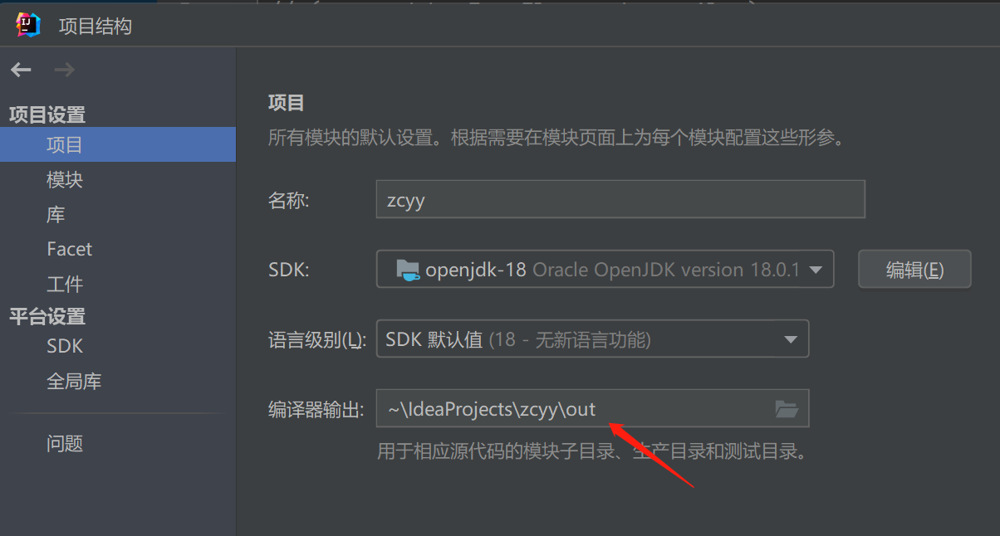</div>
<br>

- 基本上有用的就是项目结构和设置<br>  
<div align=center>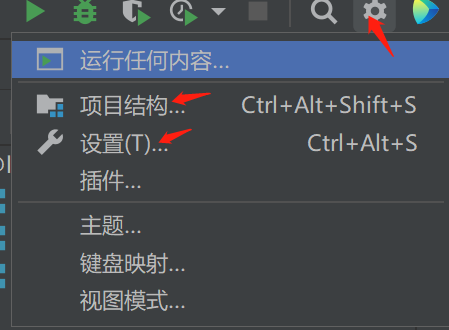</div>
<br>

# 8设置
- 自动导包<br>

<div align=center>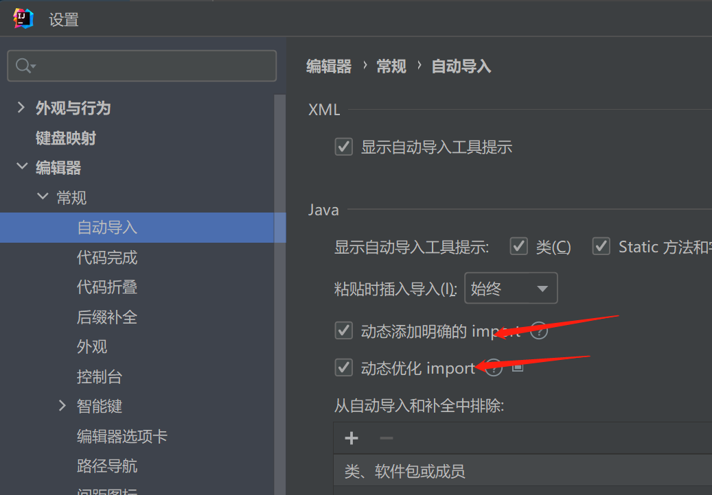</div>
<br>

- 代码提示不区分大小写
<br>

<div align=center>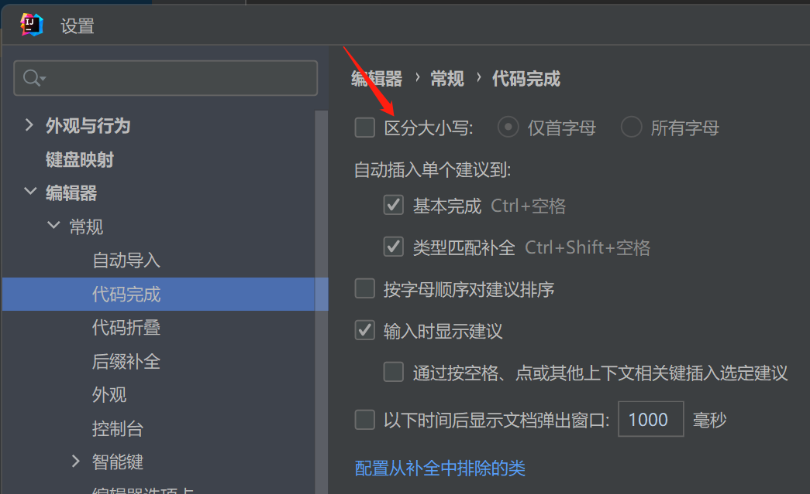</div>
<br>

- 鼠标悬停显示文档
<div align=center>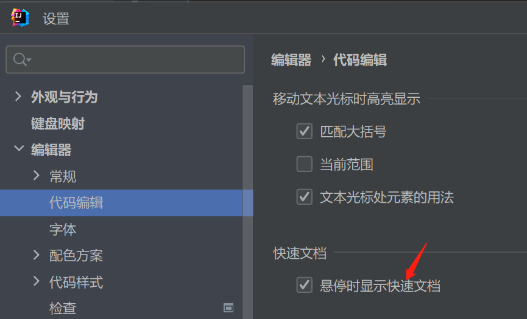</div>
<br>

# 9 快捷键的设置

- 根据功能找到对应的快捷键
<div align=center>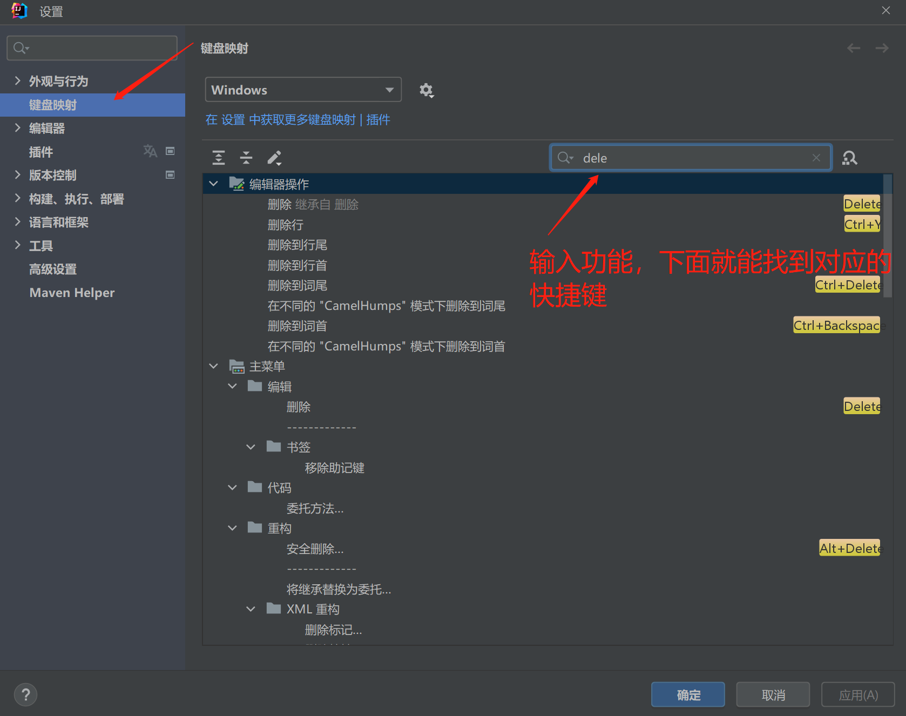</div>

- 根据快捷键找到对应的功能
<div align=center>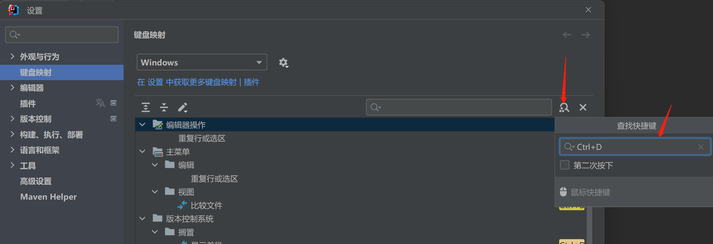</div>
  

- ctrl+/:单行注释
- ctrl+shift+/:多行注释
- alt+enter:万能纠错
- alt+left:查看上一个编辑界面
- alt+right:查看下一个编辑界面
- ctrl+alt+l：格式化代码
- ctrl+alt+l：全文搜索
- tab:选中数行，整体向后移
- shift+tab:选中代码，整体向前移
- ctrl+o:查看类的结构
- ctrl+alt+f（重构）:修改变量名与方法名
- ctrl+shift+U:大小写转化
- ctrl+d:复制光标所在行
- alt+F7:查找方法在哪里被用过
- 两下shift:查找文件
- 查看类的继承结构图：
- ctrl+alt+h:查看方法的多重重写结构
- 添加到收藏夹：
- ctrl+e:打开最近修改的文件
- 快速搜索类中的错误
- ctrl+shift+v:选择要粘贴的内容

# 10 代码模板（Templates)
- 配置一些常用代码缩写
- 常用的模板
```java
# psvm
public static void main(String[] args) {}
# sout 输出
System.out.println();
  # sout的变形1 s.sout
  System.out.println(s);
  #sout的变形2 soutp 输出参数列表
  system.out.println("args = " + Arrays.deepToString(args));
  #sout的变形3 soutm 输出方法
  System.out.println("HelloWord.main");
  #sout的变形4 soutv 输出最近一个变量
  System.out.println("s = " + s);
# fori 循环
for (int i = 0; i < ; i++) {}
  # fori的变形1 iter生成增强for循环   
  for (String arg : args) {}
  # fori的变形2 itar生成普通循环 
   for (int j = 0; j < args.length; j++) {
                String arg = args[j]; } 
# 可生成集合list的循环 list.for
for (Object o : list) {}
  # list循环的变形1 list.fori 正序遍历
  for (int i1 = 0; i1 < list.size(); i1++) {}
  # list循环的变形1 list.forr 逆序遍历
  for (int i1 = list.size() - 1; i1 >= 0; i1--) {}
# ifn 判空/xx.null
if (list == null) {}
  # ifn的变形1 inn/xx.nn
   if (list != null) {}
# psf
public static final
  #变形1 prsf
  private static final
  # 变形2 psfi
  public static final int
  # 变形3 psfs
  public static final String
```
- 修改代码模板
- 自定义代码模板

# 11 添加tomcat镜像并部署web工程
# 12 Git版本控制
GitHub- 在GitHu上共享项目- 推送到git上
<div align=center>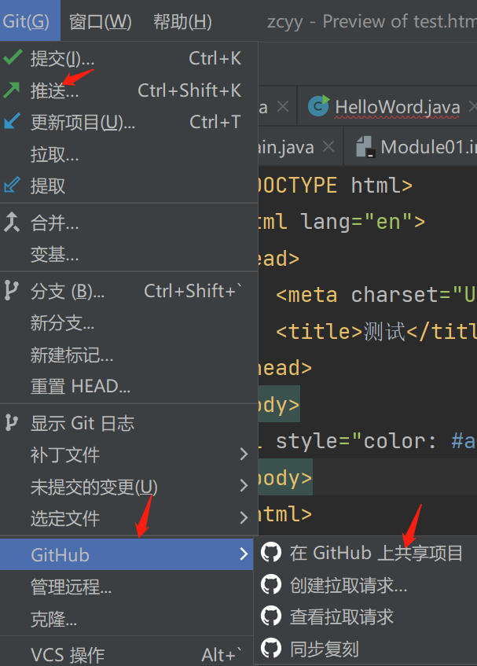</div>

- clone：拷贝远程仓库
- commit:本地提交
- push:远程提交
- pull:更新到本地
# 13 断点调试
## 关键操作
- step over：进入下一步，如果当前行断点是一个方法，则不进入当前方法体内。一行行向下执行代码。
- step into:进入下一步，如果当前行断点是一个方法，则进入当前方法体内。
- force step into:进入下一步，如果当前行断点是一个方法，则进入当前方法体内。
- step out:跳出，不想看这个方法了就out，。
- resume program:直接跳到下一个断点的位置（中间的代码也执行，但是不会停留）。
- stop:停止断点调试。
- mute breakpoints:点中，使得所有断点失效。
- view breakpoints:查看所有断点。
## 条件断点
- 循环里面加条件判断，会一次停在符合条件的这里，而不用一次次执行循环。
- 设置循环断点，在断点处右击，输入条件。
## 查看断点值
# 14 Maven的配置
# 15 生成javadoc文件
工具- 生成javadoc(设置范围、输出目录、语言、编码方式)
# 16 缓存和索引的清理
- IDEA首次加载项目的时候，都会创建索引，时间跟项目的文件多少成正比，这个过程安静等待，不要进行其他操作。
- IDEA的缓存和索引的目的是加快文件查询，加快各种查找、代码的提示速度。
- 出现蓝屏、断电时，缓存和索引文件会损坏，重新打开时，IDEA会报各种错误，甚至项目打不开。即使没有蓝屏、断电，有时候也会出现莫名奇妙的问题，这两种情况可以清理缓存和索引。文件-清除缓存。
# 17 IDEA备份
IDEA安装目录-system-localhistory(备份)-重新导入
config里面是一些快捷键、代码模板等相关配置。
# 18 插件
- 官网插件库：https://plugins.jetbrains.com/
- IDEA安装：设置-插件。注意：在国内的网络下，经常出现显示不了插件列表，或是显示了插件列表，无法下载完成安装。这时候请自行打开 VPN，一般都可以得到解决。


 